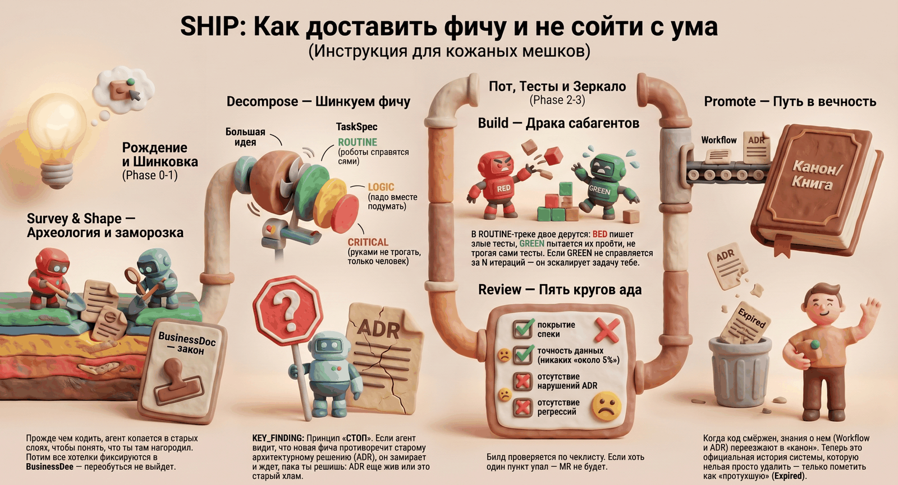

# spec-ship



**spec-ship** — это конвейер доставки фич для работы с AI-агентами (Claude Code): от идеи до готового merge request. Спецификация здесь — не пожелание, а контракт, исполнение которого проверяется на каждом шаге.

Название читается двояко: **спеку — в продакшен** (spec → ship) и акроним этапов: **S**hape → **H**and-off → **I**mplement → **P**rove.

## Зачем это нужно

Если просто попросить агента «сделай фичу», получится лотерея: агент что-то понял, что-то додумал, тесты написал под свою же реализацию, а через месяц никто не помнит, почему код устроен именно так.

spec-ship строится на одном принципе: **не доверяй — проверяй**. Каждый этап оставляет артефакт, который проверяется следующим этапом:

1. **Спека замораживается до начала кода.** Агент не может «переиграть» требования по ходу дела — изменения только через явные тикеты.
2. **Тесты и код пишут два разных агента с изолированными правами.** RED пишет только тесты и не видит реализацию. GREEN пишет только код и физически не может изменить тест. Подогнать тест под кривой код невозможно — это барьер на уровне прав файловой системы, а не просьба в промпте.
3. **Не вся работа одинаково доверяется агенту.** Каждая задача получает зону доверия: рутину агенты делают сами, сложную логику сначала проектирует человек, критичное (миграции, деньги, безопасность) человек пишет сам.
4. **Знание накапливается.** Принятые решения (ADR) и описания поведения системы (workflow-доки) попадают в канон проекта — следующая фича в той же области начинается не с нуля.

## Как выглядит процесс

```
идея/требование
   │
   ▼
[0a] survey      — разведка: что уже есть в коде          (если меняем существующее)
   ▼
[0]  shape-doc   — интервью → бизнес-спека → заморозка    (человек апрувит)
   ▼
[1]  decompose   — нарезка на задачи + зоны доверия       (человек апрувит разбивку)
   ▼
[2]  build       — два агента: RED пишет тесты, GREEN код (человек нужен только для LOGIC/CRITICAL)
   ▼
[3]  review      — проверка по чеклисту → вердикт         (человек нужен только при эскалации)
   ▼
merge request → после мёржа: adr-promote / doc-promote-feature — знание в канон
                          (+ doc-backfill — заранее, из существующего кода)
```

Команды в Claude Code: `/spec-ship:survey`, `/spec-ship:shape-doc`, `/spec-ship:decompose`, `/spec-ship:build`, `/spec-ship:review`, `/spec-ship:adr-promote`, `/spec-ship:doc-promote-feature`, `/spec-ship:doc-backfill`.

Эти этапы можно вызывать по очереди руками, а можно одним запуском: **`/spec-ship:run`** прогоняет всю цепочку, останавливаясь только там, где правда нужны вы (апрув спеки и разбивки, проектирование сложной логики, эскалации). Один вызов вместо пяти, без лишних пауз на рутине. Подробнее — [Запуск всей цепочки одной командой](docs/08-run.md).

## Документация

Начните с описания процесса, дальше — по странице на каждый шаг:

| Страница | О чём |
|---|---|
| [Процесс целиком](docs/process.md) | Путь фичи от идеи до прода на сквозном примере |
| [Шаг 0a: survey](docs/01-survey.md) | Разведка существующего кода перед изменением |
| [Шаг 0: shape-doc](docs/02-shape-doc.md) | Интервью и бизнес-спека (BusinessDoc) |
| [Шаг 1: decompose](docs/03-decompose.md) | Нарезка на задачи и зоны доверия |
| [Шаг 2: build](docs/04-build.md) | Реализация: Two-Agent TDD |
| [Шаг 3: review](docs/05-review.md) | Ревью и гейт перед MR |
| [Delivery: adr-promote](docs/06-adr-promote.md) | Решения — в канон ADR |
| [Delivery: doc-promote](docs/07-doc-promote.md) | Поведение — в канон workflow-доков (feature, backfill, внутренний конвертер) |
| [Запуск одной командой: run](docs/08-run.md) | Оркестрация всего цикла, гейты, флаги автономности |
| [Установка](docs/installation.md) | Как подключить spec-ship к своему проекту |
| [Уведомления](docs/notifications.md) | Telegram-уведомления, когда нужно ваше участие |

Техническая справка для агентов (сквозные протоколы, схемы, нотация) — [skills/README.md](skills/README.md). Это «канон», который читают сами скиллы; при установке он копируется вместе с ними.

## Быстрый старт

```bash
# 1. Установить в свой проект (подробности — docs/installation.md)
cp -r spec-ship/skills   your-project/.claude/skills/spec-ship
cp -r spec-ship/commands your-project/.claude/commands/spec-ship
cp spec-ship/agents/*.md your-project/.claude/agents/

# 2a. Вся цепочка одним запуском (рекомендуется для фич):
/spec-ship:run Фильтрация транзакций по меткам
#    → агент катит survey → shape → decompose → build → review,
#      останавливаясь только на ваших гейтах

# 2b. Или этап за этапом вручную (полный контроль):
/spec-ship:shape-doc Фильтрация транзакций по меткам
#    → интервью → BusinessDoc → ваш апрув
/spec-ship:decompose
#    → задачи → ваш апрув разбивки
/spec-ship:build task-0001-01
#    → RED-тесты → GREEN-код → BuildReport
/spec-ship:review build-0001-01
#    → чеклист → APPROVED → можно открывать MR
```

## Структура репозитория

```
skills/      8 скиллов (7 этапов + run-оркестратор) + README-канон + протокол ADR-CONFLICT
commands/    обёртки слэш-команд /spec-ship:*
agents/      сабагенты ship-red и ship-green (Two-Agent TDD)
hooks/       ship-notify.sh — Telegram-уведомления о точках участия человека
docs/        документация (вы здесь)
```

Рабочие файлы пайплайна живут в проекте-потребителе, в каталоге `.ship/`: артефакты этапов — в `.ship/pipeline/`, канон знаний — в `.ship/docs/`.

## Лицензия

См. [LICENSE](LICENSE).