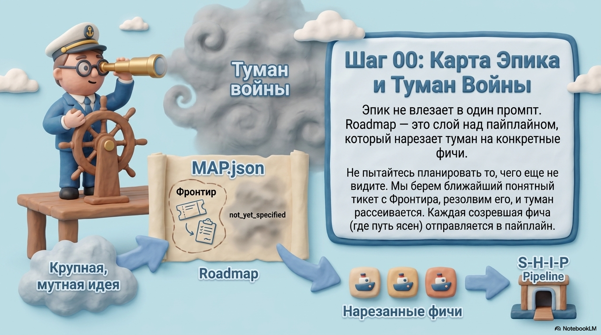

# Шаг 00. Roadmap — карта эпика над пайплайном



```
/spec-ship:roadmap Перевести денежные колонки ClickHouse на Decimal256 без overflow слабых валют
```

## Что это

Roadmap — слой планирования **над** пайплайном. Пайплайн (`survey → shape → decompose → build → review`) доставляет **одну** фичу. Roadmap работает уровнем выше: берёт крупную размытую идею — эпик на несколько фич — и чертит **карту решений**, по которой видно ЧТО делать и в каком порядке. Каждая созревшая фича уходит в `/spec-ship:run`.

Roadmap решает **ЧТО** и **в каком порядке**; `run` решает **КАК** каждую фичу. Границы жёсткие: roadmap не пишет код и не пишет BusinessDoc — только решения о скоупе и порядке.

## Зачем

Самая частая беда крупного изменения — «просто поменять X» по ходу разворачивается в дерево вскрывающихся решений: поменяли тип колонки → вскрылся overflow → потянулись materialized views → сломались тесты → откатился linter. Если гнать это через один `run`, спека замораживается в тумане и трещит на build.

Roadmap ловит это дерево **до** кода. Туман (то, что точно впереди, но ещё не сформулировать) выписывается явно и рассеивается по мере резолва тикетов — по одному, пока путь к цели не станет ясен.

## Когда запускать

Хотя бы два признака из трёх:

1. **Больше одной фичи** — не влезает в один `run`.
2. **Туман** — «сделаем X» вскрывает Y и Z по ходу; скоуп заранее не виден целиком.
3. **Сцепленные решения** — надо решить А (какая БД / какой протокол / где test seam) прежде чем формулировать фичи Б, В.

**Когда пропустить:** одна понятная фича на 3–15 слайсов → сразу [`/spec-ship:run`](08-run.md). Правка бага, бамп версии → без пайплайна вовсе. Скоуп ясен, порядок ясен, архитектура известна → карта = оверхед.

## Ключевые понятия

- **Карта = индекс, не хранилище.** `MAP.json` перечисляет принятые решения одной строкой и ссылается на тикет с деталью. Решение живёт в одном месте — своём тикете.
- **Тикет** — один вопрос, размер одной сессии. Тип: `survey` (разведка кода, AFK), `prototype` (набросок, HITL), `grilling` (интервью, HITL — дефолт), `task` (ручное действие, разблокирующее решение).
- **Туман (`not_yet_specified`)** — в-скоупе, но ещё не резкое для тикета. Тест: тикет когда можешь **сформулировать вопрос** точно, НЕ когда можешь на него ответить.
- **Out of scope** — сознательно исключённое из этого эпика. Не graduates: вернётся только если перечертить цель, и тогда как новый эпик.
- **Фронтир** — открытые, разблокированные, незаявленные тикеты (blocking через `depends_on`, как в decompose). Край известного — что можно брать сейчас.

## Как проходит

Два режима, в любом — **не более одного тикета за сессию**.

**Chart (начертить):**
1. Назвать цель — интервью движком shape-doc: какое состояние продукта = «готово». Цель фиксирует скоуп.
2. Начертить фронтир — интервью вширь (breadth-first): разложить пространство на открытые решения и первые шаги. Тумана не возникло → карта не нужна, эпик мал для одного `run`.
3. Создать `MAP.json` (цель + заметки, туман в `not_yet_specified`).
4. Создать формулируемые сейчас тикеты, вторым проходом связать `depends_on`.
5. Стоп — тикеты не резолвить.

**Work (работать по карте):**
1. Загрузить `MAP.json` (низкое разрешение, не тела всех тикетов).
2. Взять тикет фронтира (или названный), заявить (`claimed_by`).
3. Резолвить по типу (survey / shape-набросок / shape-интервью / task).
4. Записать: тикет `closed`, строка в `decisions_so_far`.
5. Выпустить новые тикеты; graduate туман, ставший формулируемым; за-целью → out-of-scope.
6. Созревшая фича (`outcome: ready_for_run`) → в `run`.

## Стык с run

Тикет, чей резолв = «фича готова к реализации», ставит `outcome: ready_for_run` и заполняет `run_handoff`. Это НЕ BusinessDoc — `run` сам проведёт shape-doc. Но handoff **обогащённый**: несёт контекст, накопленный картой, чтобы shape не переспрашивал то, что эпик уже решил:

- `feature_description` + `anchor` — сырой вход для `run`;
- `decisions` — id релевантных фиче closed-тикетов; shape читает их как контекст, а не как открытые вопросы;
- `in_scope` / `out_of_scope` — границы фичи из карты, чтобы интервью не растащило и не сузило скоуп;
- `survey_ref` — готовая карта кода, если тикет типа `survey` её создал: `run` пропускает свой survey;
- `adr_refs` — ADR, задетые решениями фичи (карта уже выявила).

```
/spec-ship:run <feature_description>; якорь <anchor>; handoff .ship/roadmap/{epic}/ticket-NN.json
```

`run` читает handoff и пробрасывает контекст в shape-doc. Roadmap про эту фичу больше не думает — она ушла в пайплайн, но не «с нуля»: решения эпика едут с ней. Карта живёт дальше: следующий тикет фронтира — следующая фича или следующее решение.

```
.ship/roadmap/checkout-v2/
 MAP.json
 ├─ ticket-01 [closed] выбор БД для корзины       → decision
 ├─ ticket-02 [closed] фича «добавить в корзину»   → ready_for_run  → /run
 ├─ ticket-03 [open]   фича «промокоды» (depends_on: 02) → фронтир после мёржа 02
 └─ not_yet_specified: стратегия миграции старых заказов
```

## Что получится

`.ship/roadmap/{epic}/MAP.json` (карта-индекс) + `ticket-NN.json` (тикеты-вопросы). По мере работы карта заполняется решениями, туман тает, созревшие фичи уходят в `run`.

## Дальше

→ [Шаг 0a: survey — разведка существующего кода](01-survey.md)
→ [Запуск фичи одной командой: run](08-run.md)
