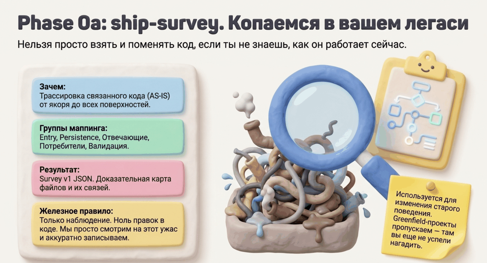

# Шаг 0a. Survey — разведка существующего кода



```
/spec-ship:survey TransactionRepository#findByPartner — добавляется фильтр по меткам
```

## Что это

Survey — трассировка существующего кода от одной конкретной точки («якоря») до всех связанных мест. Результат — доказательная карта: какие файлы придётся менять, какие учитывать, и почему именно они.

Survey **только наблюдает**. Ни одного изменения в коде — единственное, что он пишет, это собственный артефакт `survey-*.json`.

## Зачем

Самая частая причина сломанного брауфилд-изменения — «починили вызов, забыли соседей»: поменяли persistence, не обновили события; поправили метод, не заметили второго вызывающего. Survey находит этих соседей **до** планирования, и дальше все этапы опираются на карту, а не на память агента.

## Когда запускать

- Фича меняет существующее поведение (не greenfield)
- Изменение нелокальное: задевает БД, события, несколько слоёв
- Рефакторинг с сохранением поведения
- Один вызов сломан из-за изменившегося допущения (идентификатор, формат payload)

**Когда пропустить:** полностью новая фича без якоря в существующем коде — идите сразу в [shape-doc](02-shape-doc.md).

## Что на входе

**Якорь** — конкретная точка в коде плюс изменяемое допущение:
- точный символ: метод, роут, GraphQL-поле, консьюмер, падающий тест
- что именно устаревает: контракт, scope идентификатора, форма payload
- почему правка не локальная

Если якорь неоднозначен, агент спросит — угадывать он не должен.

## Как проходит

1. **Контекст.** Агент читает глоссарий проекта (`CONTEXT.md`), индекс принятых решений (`.ship/docs/adr/INDEX.md` — только строки по нужной области) и существующие workflow-доки. Если поведение уже описано доком — повторно не трассирует, проверяет только расхождения.
2. **Трассировка по ответственности.** От якоря вверх (кто вызывает) и вниз (что вызывается). Найденное группируется не по файлам, а по ролям: входные точки и оркестрация, загрузчики и резолверы, persistence, ответы и propagation (события, кеши, проекции), потребители контракта, тесты.
3. **Наблюдаемые workflow.** Каждый затронутый код-путь записывается компактной строкой: `триггер --шаг--> состояние --шаг--> [ветка 1, ветка 2]`. Это код КАК ЕСТЬ, не «как должно стать».
4. **Границы валидации.** Где входит «слабый» внешний вход, где он проверяется, на что после этого могут полагаться внутренние шаги.
5. **files_evidence.** Каждый файл — с причиной: «найден грепом» причиной не считается, причина — роль файла в связанной группе.

## Что получится

`survey-*.json`: якорь, наблюдаемые workflow, связанные группы с рисками («что сломается, если пропустить»), границы валидации, список файлов `to_change` / `read_only` с причинами.

## Кто это использует дальше

- **shape-doc** — интервью начинается не с «как сейчас работает?» (уже известно), а с «что должно измениться?»
- **decompose** — списки файлов задач берутся из survey доказательно, а не из головы
- **build** — шейп-сессия LOGIC-задачи стартует от наблюдаемых workflow
- **doc-promote** — после мёржа наблюдения станут частью канона поведения

## Типичные ошибки, от которых защищает

- список файлов без объяснения связи
- пропуск propagation: поменяли таблицу, забыли события/кеш/проекции
- трассировка только вниз от якоря (забыли вызывающих)
- «frontend затронут» без имени конкретного потребителя

## Дальше

→ [Шаг 0: shape-doc — бизнес-спека](02-shape-doc.md)
