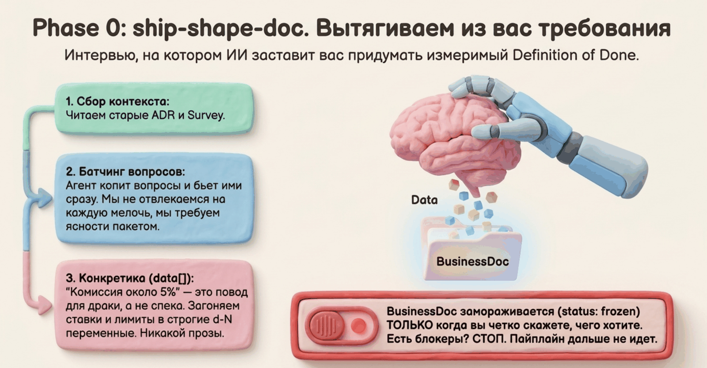
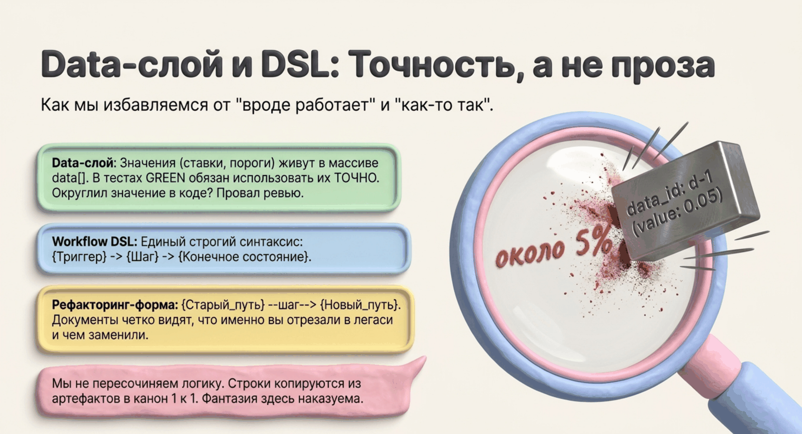

# Шаг 0. Shape-doc — интервью и бизнес-спека



```
/spec-ship:shape-doc Фильтрация транзакций по меткам
```

## Что это

Shape-doc превращает идею или требование в **BusinessDoc** — замороженную бизнес-спеку в JSON. После вашего апрува она становится контрактом: все следующие этапы строят ровно то, что в ней написано, и ничего сверх.

## Зачем

Половина провалов AI-кодинга — агент построил не то, что имелось в виду, потому что требование жило в голове и чате. BusinessDoc вынуждает договориться о деталях **до** кода: сценарии, граничные случаи, точные значения, измеримые критерии готовности. Заморозка защищает от тихого дрейфа: «по ходу дела» спеку менять нельзя, только через явное решение.

## Что на входе

- Требование или идея в свободной форме
- Survey, если фича меняет существующее поведение ([шаг 0a](01-survey.md)) — тогда интервью короче и предметнее

## Как проходит

1. **Контекст.** Агент читает глоссарий (`CONTEXT.md`), релевантные принятые ADR (через индекс, не все подряд) и survey, если есть.
2. **Интервью.** Агент выясняет: кто акторы; happy path, граничные случаи, сценарии ошибок; измеримый Definition of Done; ограничения. Вопросы копятся и задаются **пачкой**, а не дёргают вас по одному. Каждый вопрос помечен: `blocking` (без ответа спеку не заморозить) или `non_blocking` (можно ехать дальше под явно сформулированным допущением).
3. **Точные данные.** Ставки, лимиты, матрицы, шаблоны — фиксируются в поле `data` с точными значениями. «Комиссия около 5%» — это не данные, это открытый вопрос: агент дожмёт до точного значения или запишет вопрос.
4. **Requirements Review.** Перед заморозкой агент сам проверяет: покрыты ли happy/edge/sad сценарии, измерим ли DoD, нет ли конфликтов с принятыми ADR, не осталось ли blocking-вопросов без ответа. Конфликт с ADR — стоп и вопрос вам: ADR верен (переписываем спеку) или устарел (отдельный тикет на изменение ADR).
5. **Апрув.** Агент показывает BusinessDoc. Статус `approved` ставится только после вашего явного «апрув» / «ок».



## Что получится

`bd-*.json` — BusinessDoc:

- **feature** — название, цель глазами пользователя, акторы; для ветвистых фич — сквозной workflow в стрелочной нотации (если фича меняет существующий код-путь — в форме `{старый workflow} --шаг--> {новый}`)
- **acceptance_criteria** — критерии приёмки «дано / когда / тогда», каждый с типом сценария: happy, edge или sad
- **data** — точные значения, управляющие поведением (на них будут ссылаться тесты)
- **open_questions** — вопросы с ответами или допущениями (ничего не теряется в чате)
- **definition_of_done** — измеримые критерии: числа, проценты, явные проверки
- **constraints**, ссылки на учтённые ADR

## Что от вас потребуется

- Ответить на пачку вопросов интервью (обычно одну-две)
- Прочитать спеку и дать явный апрув
- При конфликте с ADR — решить: ADR верен или устарел

## Типичные ошибки, от которых защищает

- расплывчатые критерии («работает корректно») — не пройдут Requirements Review
- потерянные в чате договорённости — всё в `open_questions` с резолюциями
- константы, размазанные по тексту — точные значения собраны в `data`
- противоречие свежей фичи прошлогоднему решению — ловится до кода

## Дальше

→ [Шаг 1: decompose — нарезка на задачи](03-decompose.md)
