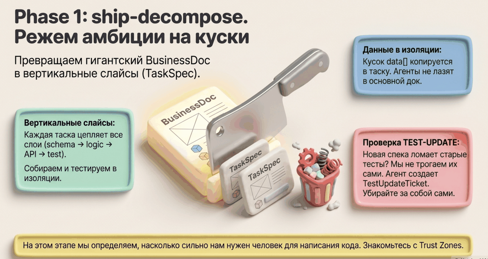
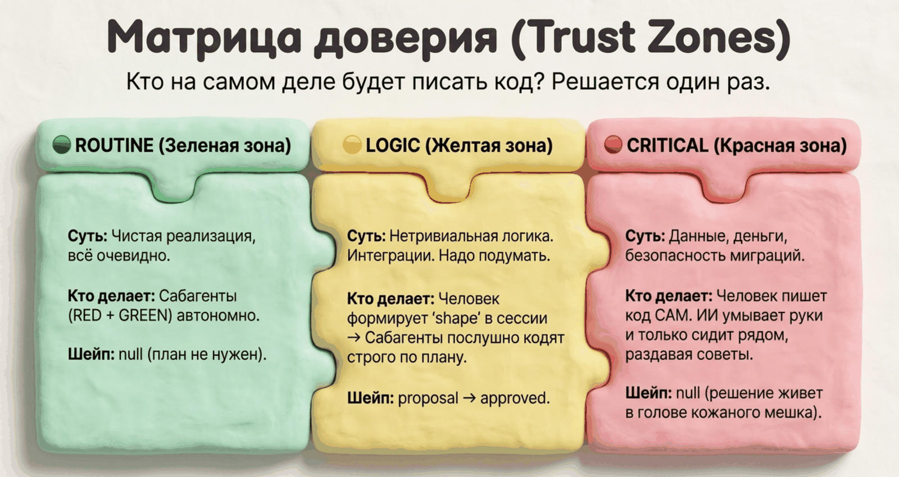

# Шаг 1. Decompose — нарезка на задачи и зоны доверия



```
/spec-ship:decompose
```

## Что это

Decompose читает апрувнутый BusinessDoc и режет фичу на **TaskSpec** — маленькие самодостаточные задачи. Каждой задаче назначается зона доверия: сколько свободы дать агенту. После сохранения задач BusinessDoc замораживается окончательно.

## Зачем

Две причины. Первая — размер: агент надёжно делает маленькие задачи с ясным контрактом и плохо — большие размытые. Вторая — риск: переименовать поле в DTO и написать миграцию денег — работы разного веса, и доверять их агенту одинаково — ошибка. Зона доверия делает это различие явным и проверяемым.

## Что на входе

- Апрувнутый `bd-*.json` (если остались blocking-вопросы без ответа — стоп, сначала дорешать)
- Survey, если был — списки файлов берутся из него доказательно

## Как проходит

1. **Вертикальные слайсы.** Фича режется не по слоям («сначала вся БД, потом весь API»), а вертикально: каждая задача проходит все нужные слои и независимо собирается и тестируется. Тонкие слайсы лучше толстых. Каждый слайс покрывает минимум один критерий приёмки.
2. **Зона доверия** для каждой задачи:

   | Зона | Признак | Что происходит дальше |
   |---|---|---|
   | `ROUTINE` | описания и интерфейса достаточно, чтобы написать код без угадывания | агенты RED/GREEN делают автономно |
   | `LOGIC` | нужны нетривиальные решения: промежуточные структуры, порядок обработки, алгоритм | в TaskSpec кладётся скелет плана (`shape`) с вопросами для вас; перед кодом — шейп-сессия |
   | `CRITICAL` | целостность данных, безопасность, миграции | агенты не запускаются; код пишете вы, агент консультирует |

3. **Сценарии тестов.** Каждая задача получает `test_scenarios` — что именно должны проверить тесты: happy, edge, sad. Для ветвистых критериев сценарии выводятся из workflow-строки BusinessDoc: каждая ветка — отдельный сценарий с явным исходом. Точные значения из `data` BusinessDoc копируются в задачу — сабагенты работают изолированно и самого BusinessDoc не видят.
4. **Проверка конфликтов с тестами.** Если новая спека противоречит существующему тесту — тест не правится втихую: создаётся отдельный тикет TestUpdateTicket, который должен явно разрешить человек.
5. **Валидация покрытия.** Каждый критерий приёмки покрыт хотя бы одной задачей; нет циклических зависимостей между задачами.
6. **Ваш апрув.** Агент показывает разбивку (название, зона, зависимости) — сохраняет только после вашего «ок». Затем BusinessDoc получает статус `frozen`.



## Что получится

- `task-*.json` (×N) — у каждой задачи: описание, интерфейс (вход/выход), список файлов «можно менять» / «только читать», сценарии тестов, зависимости, зона доверия, для LOGIC — скелет плана с пунктами «решить с разработчиком»
- `tu-*.json` — тикеты на конфликтующие тесты, если нашлись

## Что от вас потребуется

- Апрув разбивки: адекватны ли слайсы, правильно ли расставлены зоны доверия
- Особенно проверьте зоны: ROUTINE с спрятанной сложностью вернётся эскалацией, а LOGIC из чистой рутины — лишней сессией

## Типичные ошибки, от которых защищает

- задача-монстр через все домены — запрещены смешанные файлы из несвязанных областей
- критерий приёмки, который никто не реализовал — валидация покрытия
- тихая правка чужого теста «чтобы прошло» — только через тикет

## Дальше

→ [Шаг 2: build — реализация](04-build.md)
