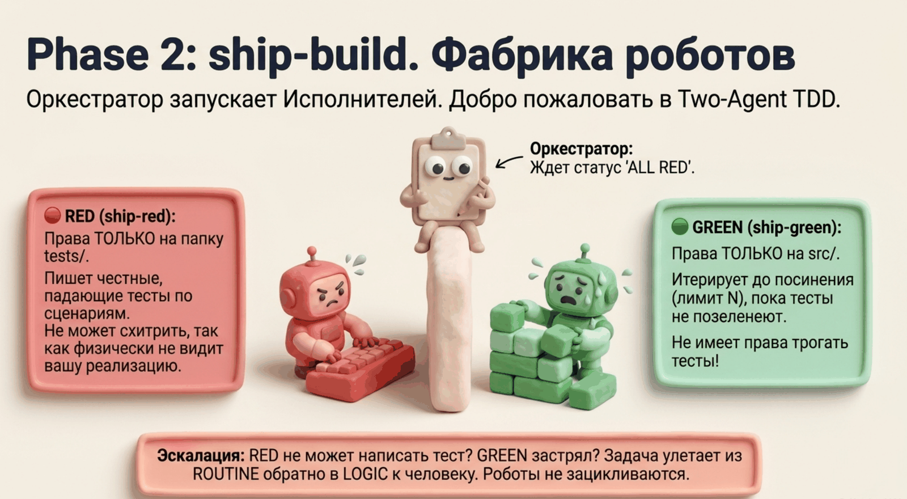
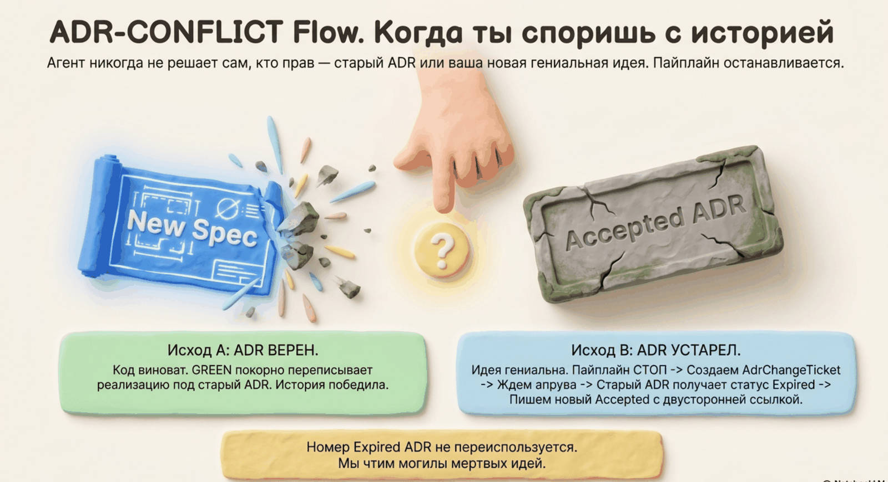

# Шаг 2. Build — реализация (Two-Agent TDD)



```
/spec-ship:build task-0001-01
```

## Что это

Build берёт одну задачу (TaskSpec) и доводит её до работающего кода с тестами. Оркестратор сам код не пишет — он выбирает маршрут по зоне доверия и управляет двумя сабагентами с изолированными правами.

## Зачем два агента

Если один и тот же агент пишет и тест, и реализацию, тест почти неизбежно «подстраивается»: проверяет то, что код уже делает, а не то, что требовалось. В spec-ship это невозможно физически:

| Сабагент | Может писать | Не может |
|---|---|---|
| **ship-red** | только `tests/` | в `src/` — никогда |
| **ship-green** | только файлы из списка задачи | трогать тесты — никогда |

Это барьер на уровне прав файловой системы, а не вежливая просьба в промпте. Контракт между агентами — сам набор тестов.

## Три маршрута

### ROUTINE — автономно

1. **RED.** Получает интерфейс и сценарии из TaskSpec. На каждый сценарий — один тест через публичный интерфейс, без моков доменных внутренностей. Если в сценарии есть workflow-строка и точные данные (`d-N`) — тест собирается ровно по ним: вход из `input`, проверка ровно `expected_outcome`, фикстуры из точных значений (не «примерно таких»). Затем агент прогоняет тесты и подтверждает: все новые — красные. Тест, который проходит без реализации, переписывается — он проверял форму, а не поведение.
2. **GREEN.** Получает задачу и список красных тестов. Пишет минимальный код, прогоняет весь suite (регрессии запрещены), повторяет. Лимит — 3 итерации. После зелёных — рефакторинг с прогоном после каждого шага.

### LOGIC — сначала проектируете вы

1. **Шейп-сессия** (~15 минут): вы с оркестратором проектируете решение. Повестка уже готова — decompose положил в задачу скелет плана с пунктами «решить с разработчиком». Если был survey — стартуете от наблюдаемых workflow, не от чистого листа.
2. Результат фиксируется в поле `shape` задачи: подход, промежуточные структуры (с именами и инвариантами), правила упорядочивания. Вы апрувите — `shape` получает статус `approved`.
3. Дальше обычные RED → GREEN, но GREEN реализует строго по вашему плану: имена и инварианты структур из `shape` — контракт, не предложение. Без апрувнутого `shape` GREEN не запустится.

### CRITICAL — только вы

Сабагенты не вызываются вовсе. Оркестратор — консультант: анализ, риски, предложения, ноль записи в файлы. Код пишете вы. В отчёте фиксируется, что реализация — ручная.

## Когда что-то идёт не так

Пайплайн не продавливает проблемы — он останавливается и поднимает их:

| Ситуация | Что происходит |
|---|---|
| RED не может написать честный тест (интерфейс неоднозначен, нет точки проверки) | задача переквалифицируется в LOGIC, блокер — в повестку шейп-сессии |
| GREEN не прошёл за 3 итерации | то же: эскалация в LOGIC, к вам |
| Тест противоречит спеке | GREEN тест НЕ трогает; создаётся TestUpdateTicket, стоп до решения человека |
| Реализация противоречит принятому ADR | стоп, вопрос вам: ADR верен (код переписывается) или устарел (тикет на изменение ADR) |



## Что получится

- Работающий код + тесты
- **BuildReport** (`build-*.json`): результаты RED и GREEN, число итераций, изменённые файлы, самопроверка (интерфейс реализован, сценарии покрыты, лишние файлы не тронуты, точные значения не «округлились»)
- Опционально — **ADREntry** (`adr-entry-*.json`): кандидат в ADR, если по ходу было принято решение, которое трудно обратимо, удивительно без контекста или результат реального компромисса. Это именно кандидат — в канон его позже промоутит человек.

## Что от вас потребуется

- ROUTINE: ничего (узнаете из уведомления, если случится эскалация)
- LOGIC: шейп-сессия и апрув плана
- CRITICAL: написать код самому, с агентом-консультантом

## Дальше

→ [Шаг 3: review — проверка](05-review.md)
