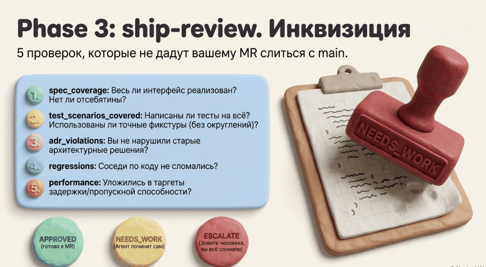

# Шаг 3. Review — проверка и гейт перед MR



```
/spec-ship:review build-0001-01
```

## Что это

Review сверяет готовый билд с его задачей, бизнес-спекой и принятыми решениями (ADR) по фиксированному чеклисту из пяти проверок и выносит машинный вердикт. Пока вердикт не APPROVED — merge request не открывается.

## Зачем

Build уже сделал самопроверку, но проверять себя — конфликт интересов. Review — независимый взгляд с конкретным чеклистом вместо «посмотри код в целом». Каждый провал — с точным адресом `файл:строка`, а не «что-то не нравится».

## Что на входе

`build-*.json` плюс его цепочка: TaskSpec, BusinessDoc, тела ADR из ссылок задачи (через индекс — не все подряд), кандидаты ADREntry.

Если билд уже содержит эскалацию — авто-ревью пропускается, проблема сразу поднимается вам.

## Пять проверок

1. **spec_coverage** — весь заявленный интерфейс реализован, недокументированных endpoint'ов и параметров нет, точные значения из `data` присутствуют в коде ровно как в спеке (тихо округлённая константа = провал).
2. **test_scenarios_covered** — на каждый сценарий из задачи есть тест; тесты идут через публичный интерфейс; если у сценария задан workflow с ожидаемым исходом — тест проверяет ровно его, не ослабленную версию; фикстуры построены из точных значений.
3. **adr_violations** — реализация не нарушает ни один ADR из ссылок задачи; новые кандидаты-решения не противоречат существующим; нет ссылок на устаревшие (Expired) ADR.
4. **regressions** — вызывающие изменённый код не сломаны, нет новых падений тестов.
5. **performance** — если Definition of Done содержит требования к latency/throughput, они адресованы.

## Вердикты

| Вердикт | Условие | Что дальше |
|---|---|---|
| **APPROVED** | все 5 прошли | `mr_ready: true` — открывайте MR |
| **NEEDS_WORK** | есть провалы, чинимо агентом | список замечаний с адресами, агент исправляет, повторное ревью |
| **ESCALATE** | фундаментальный конфликт со спекой, безопасность, архитектура | к вам, с полным контекстом |

Дополнительные блокировки MR — даже при чистом чеклисте:

- висит неразрешённый TestUpdateTicket (конфликт теста со спекой ждёт человека)
- висит неразрешённый тикет ADR-конфликта

Если проверка №3 нашла противоречие с ADR, развилка та же, что и везде: ADR верен → NEEDS_WORK (код переписать); ADR устарел → ESCALATE (решение меняет человек). Оба варианта блокируют MR до разрешения.

## Что получится

`review-*.json` — ReviewReport: вердикт, чеклист 5 проверок с заметками, список замечаний (для NEEDS_WORK/ESCALATE), флаг `mr_ready`.

## Что от вас потребуется

- APPROVED: открыть MR
- NEEDS_WORK: ничего — агент чинит и приходит снова
- ESCALATE: разобраться; контекст уже собран в отчёте

## Дальше

После апрува и мёржа MR — перенос знания в канон:
→ [adr-promote — решения](06-adr-promote.md) · [doc-promote — поведение](07-doc-promote.md)
