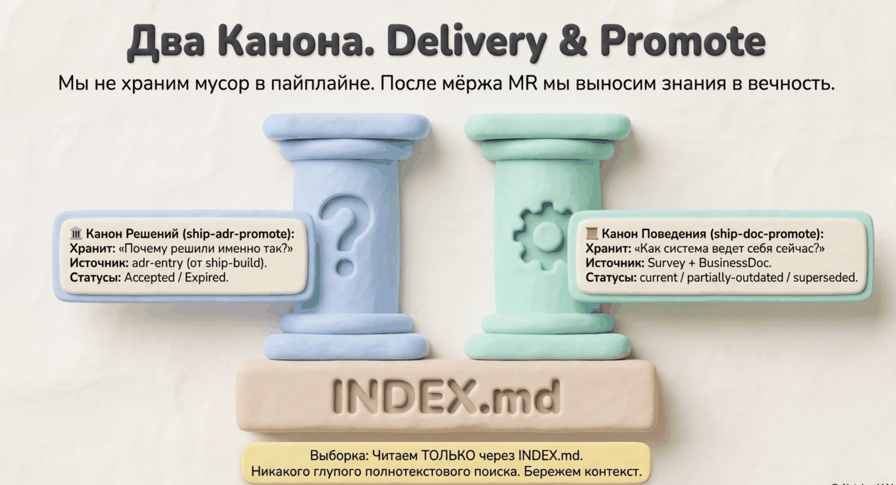

# Delivery. Doc-promote — поведение в канон



```
/spec-ship:doc-promote-feature       # после мёржа фичи (гейт APPROVED + MR)
/spec-ship:doc-backfill              # заранее, из существующего кода (без гейта)
```

## Что это

Переносит знание о **поведении системы** в долгоживущие workflow-доки `.ship/docs/workflows/` с индексом и жизненным циклом.

Зеркало adr-promote, но для другого вида знания:

| | ADR-канон | Workflow-канон |
|---|---|---|
| Хранит | «почему решили так» | «как система себя ведёт» |
| Главный читатель | shape-doc, decompose, build, review | survey следующей фичи |

## Зачем

Без канона каждый survey по одной области трассирует код заново — это дорого. С каноном survey сначала читает готовый док (только актуальные, только по нужной области через индекс) и трассирует лишь расхождения. Каждая следующая фича в области дешевле предыдущей.

## Три скилла: разделение ответственности

Промоушен разнесён на конвертер (механика) и две обёртки (политика запуска) — чтобы «как конвертить» и «когда/откуда» не смешивались в одном файле.

| Скилл | Роль | Вызывается |
|---|---|---|
| `doc-promote-internal` | **конвертер**: артефакты → workflow-док + INDEX | только из обёрток, напрямую нельзя |
| `doc-promote-feature` | **обёртка**: гейт после мёржа + сбор survey/bd | пользователем / Delivery |
| `doc-backfill` | **обёртка**: без гейта, из существующего кода | пользователем |

Конвертер закрыт от прямого вызова (`user-invocable: false` + `disable-model-invocation: true`) — агент не дёрнет его в обход гейта. Стабильная механика (Area, формат дока, INDEX, статусы) живёт в одном месте; новый сценарий запуска = новая обёртка, конвертер не трогается.

## doc-promote-feature — после мёржа фичи

Описывает поведение, которое РЕАЛЬНО в ветке, а не намерение.

```
/spec-ship:doc-promote-feature
```

1. **Гейт:** ревью APPROVED, MR смёржен. Не выполнено → не промоутит, объясняет причину. Гейт проверяет обёртка, не конвертер.
2. **Источник:** survey (поведение ДО фичи) + BusinessDoc (`feature.workflow`, критерии — поведение ПОСЛЕ). Итог описывает состояние ПОСЛЕ мёржа: workflow из bd замещают изменённые ими наблюдения survey, незатронутые переносятся как есть.
3. Если `feature.workflow` записан рефакторинг-формой `{старый} --шаг--> {новый}` — левая часть указывает замещаемый workflow канона, в документ попадает правая.
4. Обёртка передаёт собранное конвертеру `doc-promote-internal` с пометой Source `<bd-id>, <survey-id>`.

## doc-backfill — заранее, из существующего кода

Наполняет канон поведением **уже написанного** кода — до того как по этой области пойдёт новая фича. Цель: типовые паттерны (graphql-эндпоинт, отчёт, колонка, консьюмер) описать один раз, чтобы будущие фичи стартовали не с нуля.

```
/spec-ship:doc-backfill
```

1. **Предусловие:** есть `survey-*.json`, трассирующий код текущей ветки. ReviewReport и MR-гейт НЕ требуются — фичи нет, есть существующий код.
2. **Источник:** только survey. bd отсутствует, поэтому `observed_workflows` survey — это и есть финальное поведение (не «AS-IS до фичи»).
3. **Помета:** обёртка передаёт конвертеру Source `backfill (<survey-id>)` — видно, что канон извлечён из готового кода, а не прошёл пайплайн.
4. Когда фича позже изменит этот код-путь, `doc-promote-feature` сделает amend и заместит backfill-наблюдение точным TO-BE.

Типовой заход: `/spec-ship:survey <эталонный символ>` (если survey ещё нет) → `/spec-ship:doc-backfill`. Для паттерна полезно разводить два уровня: документ-**паттерн** (шаблон слоёв, переиспользуемый) и документ-**экземпляр** (конкретная фича) — они ссылаются друг на друга.

## Что делает конвертер (общее для обеих обёрток)

Эти шаги исполняет `doc-promote-internal` — обёртки лишь готовят вход и передают помету.

1. **Целевой документ.** Область (Area) выводится из затронутых файлов. Док по этому код-пути уже есть → amend (обновить), нет → create.
2. **Сборка.** Формат: Definitions (структуры, таблицы, события), Workflows (стрелочная нотация + пояснения), словарь имён состояний. Стрелочные строки копируются из артефактов, не пересочиняются. Документ читается без открытия кода.
3. **Индекс.** Строка в `.ship/docs/workflows/INDEX.md`: документ, статус, область, источник, дата. Если знание задело поведение в **других** доках — им проставляется честный статус: `partially-outdated` или `superseded`. Молча лгущий документ — худший исход.

## Жизненный цикл документов

| Статус | Значение |
|---|---|
| `current` | авторитетно описывает поведение; survey ему доверяет |
| `partially-outdated` | частично устарел; что именно — отмечено внутри; кандидат на amend |
| `superseded` | замещён другим документом; только история |

## Что от вас потребуется

- **doc-promote-feature:** инициировать после мёржа; подтвердить, какие чужие доки получили `partially-outdated`/`superseded`
- **doc-backfill:** выбрать эталонный код, прогнать survey, инициировать промоушен; подтвердить уровень (паттерн или экземпляр) и Area

## Дальше

Цикл замкнулся: следующая фича в этой области начнёт survey с чтения свежего канона.
→ [Назад к процессу](process.md)