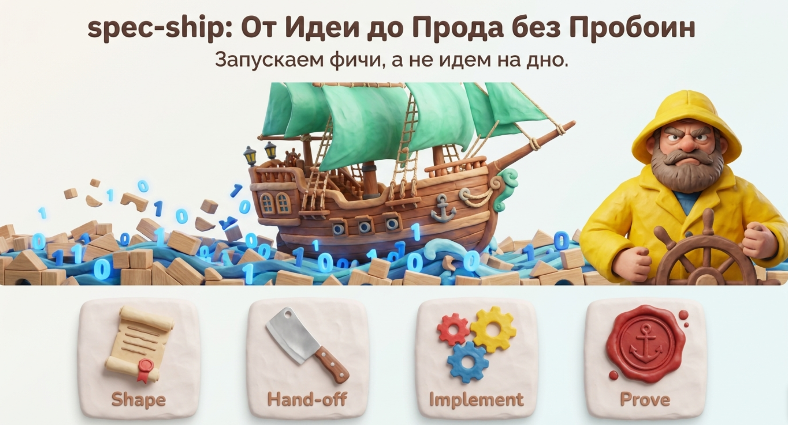
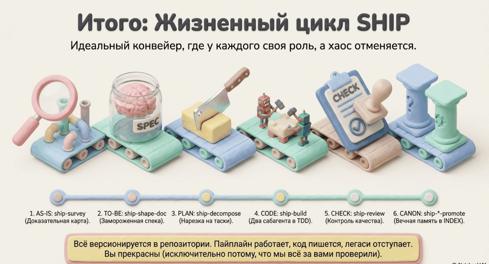

# Процесс целиком: путь фичи от идеи до прода



Эта страница — обзорная. Она показывает весь конвейер на одном сквозном примере. Детали каждого шага — на отдельных страницах (ссылки по ходу текста).

## Главная идея в трёх предложениях

Сначала фиксируем, **что** строим (спека), и замораживаем — дальше она контракт, а не черновик. Потом строим так, чтобы **нельзя было сжульничать**: тесты и код пишут два изолированных агента, и ни один не может подыграть другому. В конце проверяем по чеклисту и складываем полученное знание в канон проекта — чтобы следующая фича была дешевле.

## Действующие лица

- **Вы** (Dev/BA/maintainer) — отвечаете на вопросы, апрувите спеку и разбивку, проектируете сложную логику, принимаете эскалации, мёржите MR.
- **Агент-оркестратор** — основная сессия Claude Code: ведёт интервью, нарезает задачи, управляет билдом, делает ревью.
- **ship-red** — сабагент, пишет только падающие тесты. Не имеет права писать в `src/`.
- **ship-green** — сабагент, пишет только код реализации. Не имеет права трогать тесты.

## Сквозной пример

Допустим, нужна фича: **«Фильтрация транзакций по меткам»** в существующем сервисе.

### Шаг 0a. Survey — разведка ([подробнее](01-survey.md))

Фича меняет существующее поведение, поэтому сначала разведка:

```
/spec-ship:survey TransactionRepository#findByPartner — добавляется фильтр по меткам
```

Агент трассирует код от указанной точки («якоря»): кто вызывает этот метод, что он сам вызывает, какие таблицы, события и тесты связаны. Результат — `survey-*.json`: карта связанного кода с доказательствами, где каждый файл снабжён причиной «почему он здесь». Сами файлы агент не меняет — только наблюдает.

Если фича полностью новая (greenfield) — этот шаг пропускается.

### Шаг 0. Shape-doc — бизнес-спека ([подробнее](02-shape-doc.md))

```
/spec-ship:shape-doc Фильтрация транзакций по меткам
```

Агент проводит интервью: кто пользователи, какой happy path, какие граничные случаи и ошибки, как измерим «готово». Вопросы задаются пачками, а не по одному. Если был survey — агент уже знает, как код работает сейчас, и спрашивает только о том, что должно измениться.

Результат — **BusinessDoc** (`bd-*.json`): цель, акторы, критерии приёмки в формате «дано/когда/тогда», точные значения (ставки, лимиты — в специальном поле `data`, чтобы «комиссия около 5%» не превратилась в коде в 4.9), открытые вопросы, измеримый Definition of Done.

**Ваш ход:** прочитать и сказать «апрув». После апрува спека — закон.

### Шаг 1. Decompose — нарезка ([подробнее](03-decompose.md))

```
/spec-ship:decompose
```

Агент режет фичу на **вертикальные слайсы** — маленькие задачи, каждая проходит через все слои (схема → логика → API → тест) и собирается независимо. Каждой задаче назначается **зона доверия**:

| Зона | Кто делает | Пример |
|---|---|---|
| `ROUTINE` | агенты сами | CRUD, маппинги, типовые обработчики |
| `LOGIC` | вы проектируете → агенты реализуют | алгоритмы, агрегации, нетривиальные структуры |
| `CRITICAL` | только вы, агент консультирует | миграции, деньги, безопасность |

Результат — несколько **TaskSpec** (`task-*.json`): у каждой задачи интерфейс, сценарии тестов, список файлов, которые можно менять.

**Ваш ход:** апрув разбивки. После этого BusinessDoc замораживается окончательно (`frozen`).

### Шаг 2. Build — реализация ([подробнее](04-build.md))

```
/spec-ship:build task-0001-01
```

Для ROUTINE-задачи работает **Two-Agent TDD**:

1. **RED** получает сценарии тестов из TaskSpec и пишет по падающему тесту на каждый. Он читает `src/`, но писать может только в `tests/` — тест честный, под несуществующую реализацию его не подгонишь.
2. Оркестратор убеждается: все тесты красные (падают).
3. **GREEN** получает TaskSpec и красные тесты. Пишет минимальный код, пока тесты не позеленеют. Менять тесты он не может физически — хук-барьер `ship-guard.sh` отклоняет запись в `tests/` от ship-green. Лимит — 3 итерации, дальше эскалация.

Для LOGIC-задачи сначала **шейп-сессия**: вы с агентом за ~15 минут проектируете решение (подход, структуры данных, инварианты), оно фиксируется в TaskSpec, вы апрувите — и только потом RED/GREEN реализуют по вашему плану.

Для CRITICAL агенты не запускаются вовсе: агент — консультант, код пишете вы.

Результат — **BuildReport** (`build-*.json`) и, если по ходу было принято заметное архитектурное решение, — кандидат в ADR (`adr-entry-*.json`).

Если что-то пошло не так, пайплайн не продавливает: тест противоречит спеке → тикет TestUpdateTicket и стоп; код противоречит принятому ранее ADR → вопрос человеку; GREEN не справился за 3 итерации → задача переквалифицируется в LOGIC и идёт к вам.

### Шаг 3. Review — проверка ([подробнее](05-review.md))

```
/spec-ship:review build-0001-01
```

Пять проверок: интерфейс реализован полностью; каждый сценарий покрыт тестом (и тест проверяет ровно заявленный результат, не ослабленный); ни один ADR не нарушен; нет регрессий; performance-требования из Definition of Done адресованы.

Вердикты: **APPROVED** (можно открывать MR), **NEEDS_WORK** (агент чинит сам), **ESCALATE** (нужны вы). MR не откроется, пока висит неразрешённый тикет.

### Delivery. Promote — знание в канон ([adr-promote](06-adr-promote.md), [doc-promote](07-doc-promote.md))

После апрува и мёржа MR — два ручных шага maintainer'а:

- `/spec-ship:adr-promote` — кандидаты решений превращаются в канонические ADR (`.ship/docs/adr/ADR-NNN.md`): «почему сделано так».
- `/spec-ship:doc-promote-feature` — знание из survey и BusinessDoc складывается в workflow-доки (`.ship/docs/workflows/`): «как система себя ведёт». (Для существующего кода без фичи — `/spec-ship:doc-backfill`.)

Зачем: следующий survey по этой же области не трассирует код заново — он читает готовый док. Следующий shape-doc не конфликтует с принятыми решениями — он их видит. Знание дешевеет с каждой фичей.



## Где что лежит

```
.ship/
├── pipeline/                       одноразовые артефакты фич (аудит-след)
│   └── bd-2026-0001-tx-label-filter/
│       ├── survey-bd-2026-0001.json
│       ├── bd-2026-0001.json
│       ├── task-0001-01.json … task-0001-NN.json
│       ├── build-0001-01.json
│       └── review-0001-01.json
└── docs/                           накапливаемый канон
    ├── adr/        ADR-NNN-*.md + INDEX.md      («почему решили так»)
    └── workflows/  *.md + INDEX.md              («как система себя ведёт»)
```

Все артефакты — JSON по схемам, версионируются в репозитории вместе с кодом.

## Когда spec-ship НЕ нужен

Прототипы, спайки, одноразовые скрипты, правка опечатки — церемония дороже пользы. spec-ship окупается там, где ошибки дорогие (продакшен, деньги, данные) и где проект живёт долго (канон знаний накапливается).
